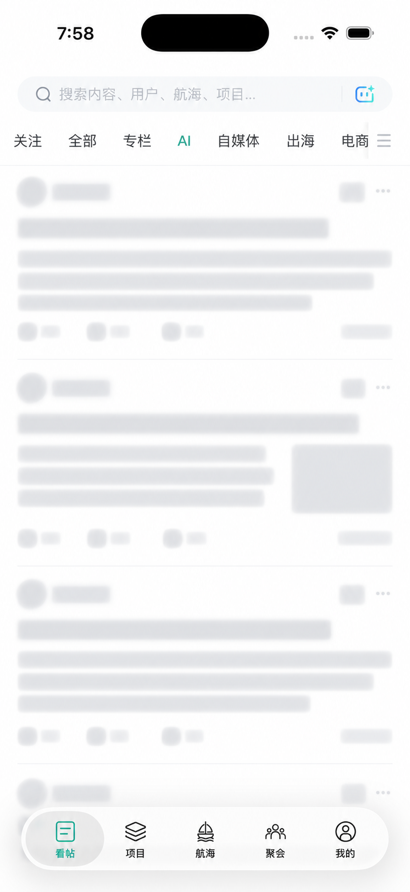

# 生财有术 App

> **非官方项目**：本项目由社区成员独立开发，与生财有术官方无隶属、授权或合作关系。

一个轻量的 Flutter 双端外壳，在 iOS 与 Android 系统 WebView 中打开
`https://scys.com`。

## 应用截图

<p align="center">
  
</p>

## 应用信息

- 显示名称：生财有术
- iOS Bundle ID：`me.suge.scys`
- Android Application ID：`me.suge.scys`
- 当前版本：`1.0.0+1`

## 页面行为

- `scys.com`、`shengcaiyoushu.com` 及其子域名在 App 内打开。
- 微信扫码登录页 `open.weixin.qq.com` 在 App 内打开，方便截图后由另一台设备扫码。
- 其他 HTTPS 网页交给系统浏览器。
- 微信、电话和邮件协议交给对应系统应用。
- 危险或不受支持的导航会被阻止。
- 支持网页返回、加载进度和主页面加载失败后的重试。

## 原生导航

当前版本保留完整官网 WebView，并以五栏原生底部导航替代网页导航：

- 看帖、项目、航海、聚会、我的五个入口与官网移动端路由同步。
- iOS 使用 SwiftUI 原生标签栏，并在支持的系统上呈现液态玻璃效果。
- Android 使用 Flutter 原生底部导航。
- 根页面禁用横滑返回，进入详情页后恢复 iOS WebView 的返回手势。
- 网页自身的底部导航会自动隐藏，避免出现双层导航。

## Android

本地构建产物统一放在 `release/` 目录，该目录不会提交到源码仓库。

本项目使用 Java 17 构建。如果机器的 `JAVA_HOME` 指向其他版本，可以执行：

```bash
JAVA_HOME=/opt/homebrew/opt/openjdk@17/libexec/openjdk.jdk/Contents/Home \
  flutter build apk --release
```

当前 APK 使用 Flutter 模板的调试签名配置，适合直接安装测试。正式公开分发前应创建并妥善保存独立的 Android 发布密钥。

## iOS

最新签名 IPA 为 `release/生财有术-1.0.0-SwiftUI液态玻璃导航-ios.ipa`。

该开发版 IPA 已包含 `me.suge.scys` 的描述文件，仅可安装到本次登记的 iPhone。
当前使用免费的 Personal Team 签名，描述文件有效期至 2026-09-18，到期后需重新签名。

未签名版本包含完整的 iPhone arm64 Release 应用，但不能直接安装到真机；安装前必须用
Apple 开发者账号和与 `me.suge.scys` 匹配的描述文件签名。

如果手机上已有由其他团队签名、但 Bundle ID 同为 `me.suge.scys` 的旧版本，iOS 不允许直接覆盖；请先备份需要的数据，再删除旧版本后安装。

### 真机签名

1. 安装完整 Xcode 和 CocoaPods。
2. 在 Xcode 的 Settings > Accounts 中登录 Apple ID。
3. 执行 `flutter pub get`。
4. 打开 `ios/Runner.xcworkspace`。
5. 在 Runner 的 Signing & Capabilities 中选择自己的 Team，并保持 Automatically manage signing 开启。
6. 连接 iPhone 后运行，或 Archive 后按自己的证书方式导出已签名 IPA。

项目位于 iCloud Drive；若命令行构建遇到扩展属性导致的签名错误，可先把项目复制到本机非 iCloud 目录再构建。

## 质量检查

```bash
flutter test
flutter analyze
```
